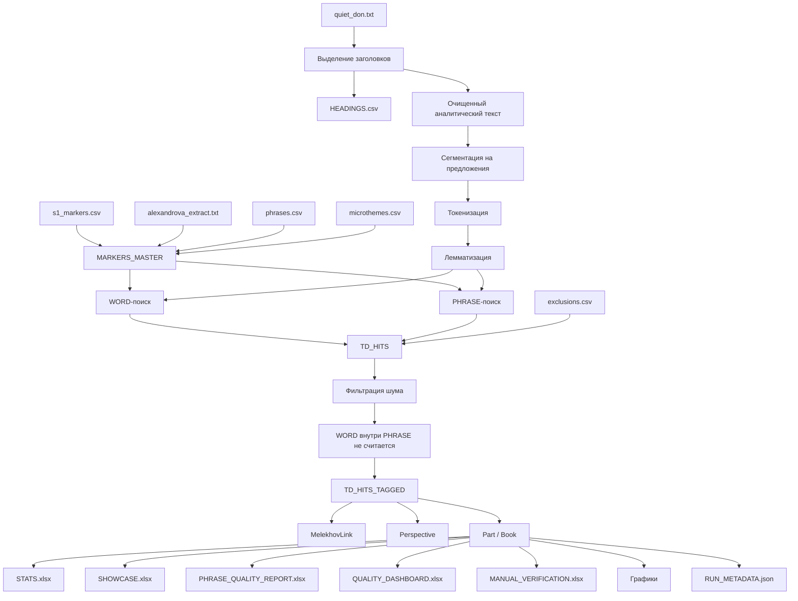
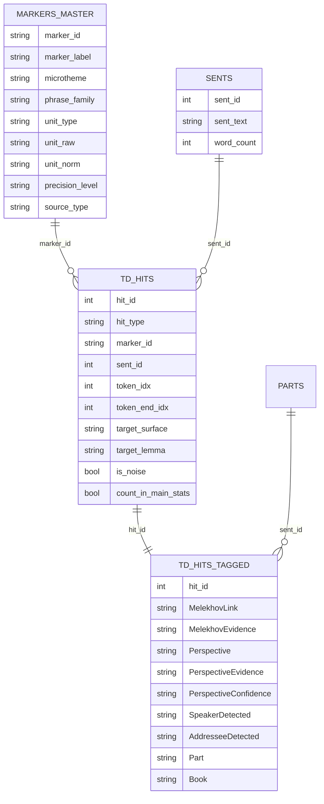

# Финальная техническая документация TD-MindMarkers

## 1. Паспорт проекта

| Параметр | Значение |
|---|---|
| Название | TD-MindMarkers |
| Тип | Python-пайплайн корпусно-филологического анализа |
| Материал | роман М. А. Шолохова «Тихий Дон» |
| Основной герой | Григорий Мелехов |
| Предмет анализа | маркеры мыслительной деятельности |
| Подход | правиловой NLP: словари, лемматизация, фразовые шаблоны, эвристики |
| Основной профиль | `DIPLOMA_STRICT` |
| Основные результаты | CSV/Excel/PNG/SVG/JSON |

## 2. Смысл разработки

Проект предназначен для того, чтобы перейти от ручного выборочного анализа отдельных цитат к воспроизводимой корпусной процедуре. Он извлекает маркеры мыслительной деятельности, связывает их с контекстами Григория Мелехова и создаёт статистические и визуальные материалы для ВКР.

## 3. Архитектура

## 4. Модель данных

## 5. Словарная база

Файл `phrases.csv` содержит 686 фразовых маркеров. Каждый маркер имеет микротему, семейство, уровень точности и комментарий о возможном риске шума.

Ключевые микротемы:

- процесс размышления;
- инициация мысли;
- память / воспоминание;
- понимание / ясность;
- решение / намерение;
- сомнение / колебание;
- внутренняя речь;
- догадка / соображение;
- навязчивая мысль;
- голова / ум как орган мышления;
- побуждение к мышлению;
- эмоционально окрашенная мысль.

## 6. Алгоритм извлечения

WORD-маркеры ищутся по нормальной форме слова. PHRASE-маркеры ищутся по последовательности лемм с допустимым разрывом `phrase_gap = 2`. При вложенных фразах используется режим `prefer_longest`. Это позволяет избежать ситуации, когда `ему стало ясно` и `стало ясно` одновременно увеличивают частоту одного и того же когнитивного события.

## 7. Привязка к Григорию Мелехову

| Метка | Значение |
|---|---|
| `YES` | имя героя найдено в том же предложении |
| `PROBABLE` | имя героя найдено в соседнем предложении |
| `NO` | связь с героем не обнаружена |

Поле `MelekhovEvidence` показывает основание разметки.

## 8. Речевая перспектива

| Категория | Интерпретация |
|---|---|
| `HERO_INNER_SPEECH` | внутренняя речь героя |
| `HERO_DIRECT_SPEECH` | прямая речь героя |
| `NARRATOR_ABOUT_HERO` | повествователь сообщает о мышлении героя |
| `OTHERS_TO_HERO` | другой персонаж обращается к герою или побуждает его думать |
| `OTHERS_ABOUT_HERO` | другой персонаж говорит о герое |
| `OTHERS_NEAR_HERO` | чужая речь рядом с героем |
| `UNKNOWN` | перспектива не определена |

Финальная версия усиливает поверхностную атрибуцию говорящего и адресата через поля `SpeakerDetected` и `AddresseeDetected`.

## 9. Отчёты

`STATS.xlsx` содержит основные таблицы: частотность, покрытие, микротемы, перспективы, плотность, индексы, семейства фраз и матрицы.

`SHOWCASE.xlsx` содержит готовые примеры для ВКР, включая `BEST_THESIS_EXAMPLES`.

`PHRASE_QUALITY_REPORT.xlsx` показывает качество фразового словаря.

`QUALITY_DASHBOARD.xlsx` собирает предупреждения и сомнительные случаи.

`MANUAL_VERIFICATION.xlsx` предназначен для ручной экспертной проверки.

## 10. Аналитические индексы

Введены интерпретируемые показатели:

- когнитивная плотность: число засчитанных маркеров на 10000 слов;
- индекс внутренней речи: доля `HERO_INNER_SPEECH` среди связанных контекстов;
- индекс внешнего когнитивного давления: доля чужой речи о/к герою;
- индекс расширенной когнитивности: доля `EXTENDED` среди `CORE + EXTENDED`.

Эти показатели не являются психологическими измерениями личности героя. Они являются формальными корпусными индикаторами распределения языковых маркеров.

## 11. Ограничения

Главное ограничение — правиловой характер анализа. Система не понимает художественный текст как человек. Она выделяет формальные маркеры и применяет объяснимые эвристики. Поэтому итоговая интерпретация должна опираться на ручную проверку таблиц `MANUAL_VERIFICATION.xlsx`, `QUALITY_DASHBOARD.xlsx` и `SHOWCASE.xlsx`.
