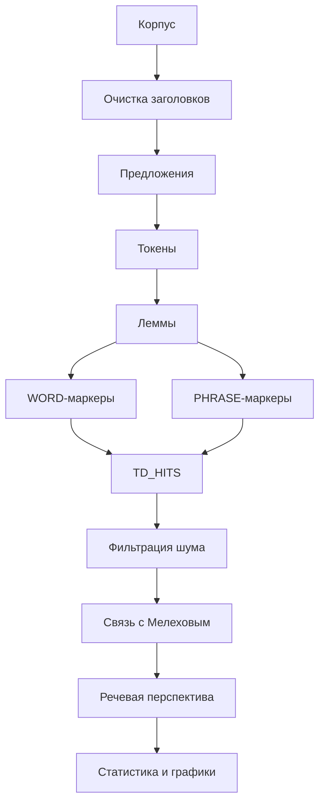

# Связь проекта TD-MindMarkers с текстом ВКР

## 1. Раздел о постановке задачи

Использовать описание назначения проекта из `docs/PROGRAM_DESCRIPTION.md`: программа предназначена для автоматизированного анализа маркеров мыслительной деятельности в романе «Тихий Дон» с фокусом на контекстах Григория Мелехова.

## 2. Раздел о входных данных

Описать:

- `quiet_don.txt` как локальный полный корпус;
- `quiet_don_SAMPLE.txt` как тестовый корпус;
- `s1_markers.csv` как исходное ядро маркеров;
- `alexandrova_extract.txt` как дополнительный слой;
- `phrases.csv` как расширенный фразовый словарь;
- `microthemes.csv` как справочник микротем;
- `parts.csv` как заданную проектную сегментацию.

## 3. Раздел об алгоритме

Включить схему:

## 4. Раздел о программной реализации

Описать модули:

| Модуль | Назначение |
|---|---|
| `run_pipeline.py` | управляющий сценарий |
| `build_markers.py` | построение `MARKERS_MASTER` |
| `extract_hits.py` | поиск маркеров |
| `tag_hits.py` | связь с героем и речевая перспектива |
| `make_stats.py` | статистика и отчёты качества |
| `make_showcase.py` | витрина примеров |
| `make_plots.py` | графики |
| `validate_project.py` | проверка готовности проекта |

## 5. Раздел о результатах

Использовать:

- `STATS.xlsx` для таблиц;
- `SHOWCASE.xlsx` для примеров;
- `BEST_THESIS_EXAMPLES` для качественного разбора;
- `PHRASE_QUALITY_REPORT.xlsx` для контроля словаря;
- `QUALITY_DASHBOARD.xlsx` для качества;
- `MANUAL_VERIFICATION.xlsx` для ручной проверки;
- `plot_*.png` для рисунков.

## 6. Раздел об ограничениях

Указать, что система использует правиловой подход и не выполняет полноценное семантическое понимание текста. Спорные случаи выносятся в ручную проверку.
